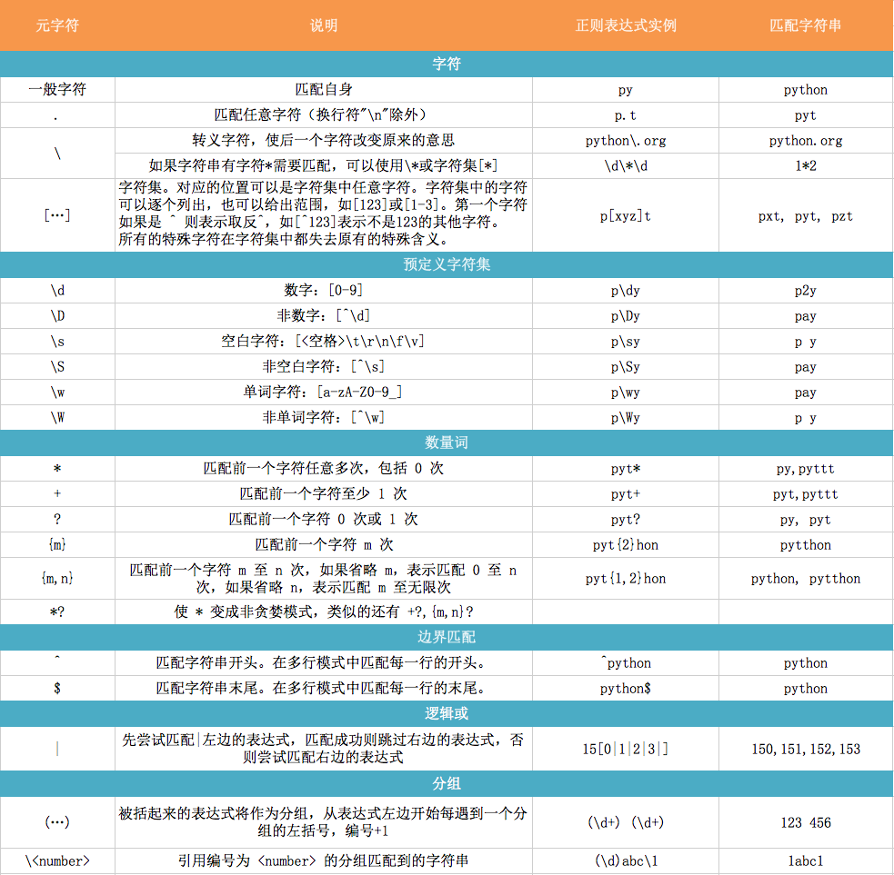

# 正则表达式介绍

**正则表达式** （Regular Expression）是一段字符串，可以用来在一段文本中，查找，替换有规律的信息。

> 做一个比喻，假设在你的面前有一万个人，我让你去找一个人，他有如下特点：皮肤是绿色的，身高三米，内裤套在头上。那么只要这个人在这一万人中，你就能一眼找到他。如果我让你从这一万人中找十个有这种特征的人，你也可以在一瞬间把这十个人从这一万人中找出来。这个寻找的过程，在正则表达式中，叫做“匹配”。而你的大脑，天生就具有正则表达式的功能。

在计算机中，我们需要让计算机程序从一大段文本中找到我们需要的内容。就可以使用正则表达式来帮助我们。


## 基本使用

使用正则表达式有如下步骤：

1. 寻找规律
2. 使用正则符号表示规律
3. 提取信息



- 点号： `.`
    - 代表任意除了`\n`以外的字符
    - 点号就是一个占位符
    - 一个点号代表一个字符

- 星号： `*`
    - 代表它前面的子表达式0次到多次
    - carson -> ca.*n
    - carson -> ca*
    - carson -> cat*

- 问好： `?`
    - 代表他前面的子表达式0次或者
    - carson -> ca.?son
    - carson -> cart?son

- 转义字符： `\`
    - 不能单独使用
    - 让有特俗意义的字符转义普通的字符：`\*` -> `*`
    - 让普通字符变成特殊字符：`\d`

- 括号的使用

    **`()`** 是为了提取匹配的字符串。当我们使用正则表达式提取内容的时候，可能只想提取部分内容，于是我们需要使用括号来标记我们需要的内容。

    ```    
    字符串： jikexueyuan
    正则表达式： jike...yuan
    匹配结果： jikexueyuan
    正则表达式：jike(....)yuan
    匹配结果： xue
    ```

- 提取数字

    正则表达式里使用 **`\d`** 来表示一位数字。注意，要把\d看成是一个正则表达式符号整体。

    如果要提取两个数字，我们可以使用 \d\d，如果要提取三个数字，我们可以使用\d\d\d。**`+`** 号可以匹配它前面的符号一次或者多次。所以使用 \d+，可以表示一个任意位数的数字。


- 提取文本

    对于文本来说，我们在爬虫中一般使用 `.*?` 这三个符号来完成。

    我们知道点号表示任意非换行符的字符，星号表示匹配它前面的字符零次或者任意多次。所以  `.* ` 表示匹配一串任意长度的字符串任意次。这个时候必须在  `.* ` 的前后加其他的符号来限定范围，否则得到的结果就是原来的整个字符串。

    如果在  `.* ` 的后面加一个问号变成 `.* ?` ，那么可以得到什么样的结果呢？问号表示匹配它前面的符号0次或者1次。于是 `.* ?` 的意思就是，匹配一个能满足要求的最短字符串。

    - `.* ` ：外号贪心算法，获取最长的满足条件的字符串

    ```
    import re
    carson = "I'm carson, I'm student, I'm pythoner and I'm noder"
    re.findall("I'm (.*)", carson)
    ["carson, I'm student, I'm pythoner and I'm noder."]
    ```

    - `.* ?` ：外号非贪心算法，获取最短的能满足条件的字符串

    ```
    import re
    carson = "I'm carson, I'm student, I'm pythoner and I'm noder,"
    re.findall("I'm (.*?"),", carson)
    ['carson', 'student', 'pythoner', 'noder']
    ```

    **注意的 `.` 不能匹配 `\n`**：

    ```
    #coding=utf-8
    with open('text.txt') as f:
        text = f.read()
        print text
        # 大家好，我的名字是：carson
        # chen，我的手机号是：10088
        # 66，
        print re.findall("：(.*?)，text)
        # []
        print re.findall("：(.*?\n.*?)，", text)
        # ['carson\nchen', '10088\n66']
    ```

- `re.findall(pattern, string, flags=0)` 返回匹配列表，flags 参数可以省略，忽略大小写：`re.S`

```
text = "我的银行卡账号是：12345，密码是：54321。扣扣账号是：1129247380，密码是：12345。"

re.findall("账号是：(.*?)，密码是：(.*?)。", text)
# [('12345', '54321'),('1129247380', '12345')]
```

- `re.search(pattern, string, falgs=0)` 返回一个正则表达式对象，需要通过 `.group()` 方法来获取里面的值

```
text = "我的银行卡账号是：12345，密码是：54321。扣扣账号是：1129247380，密码是：12345。"

result1 = re.search("账号是：(.*?)，密码是：(.*?)。", text)
result2 = re.search("账号是：(.*?)，", text).group()
print result1, result2
# <_sre.SRE_Match object at 0x000000000211DBE8> 账号是：12345，

#######################################################
print resutl2.group(0) # 账号是：12345，密码是：54321。
print result1.group(1) # 12345
print result1.group(2) # 54321
print result1.group(3) # error
```


## 正则表达式的技巧

1. 不需要 `complie`

查看 `re.py` 的源代码可以发现，`findall`，`search`方法中会调用 `complie` 方法处理正则，所以不必多此一举。（不受 Java 编程思维影响）

2. 先抓大后抓小

```
example_text = '''
有效用户:
姓名: 张三
姓名: 李四
姓名: 王五
无效用户:
姓名: 死人
姓名: 僵尸
'''
# user = re.findall('姓名: (.*?)\n', example_text)
# print(user)

user_big = re.findall('有效用户(.*?)无效用户', example_text, re.S)
print('user_big 的值为: {}'.format(user_big))

user_useful = re.findall('姓名: (.*?)\n', user_big[0])
print(user_useful)
```

- Python正则表达式的库文件为re.py, 里面的注释就是非常好的使用文档

```
Windows下：
C:\Python3.5\Lib\re.py

Mac下：
/usr/local/Cellar/python3/3.5.1/Frameworks/Python.framework/Versions/3.5/lib/re.py

Linux下：
sr/lib/python3.5/re.py
```
